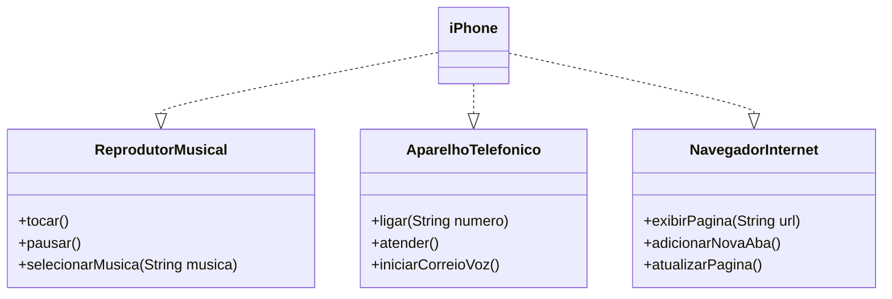

# Projeto iPhone - Modelagem UML e Implementação em Java

## 📌 Descrição
Este projeto faz parte do desafio da **DIO - Bradesco Cloud Native**, onde foi proposta a modelagem e implementação das funcionalidades principais do primeiro iPhone, conforme apresentado no lançamento de 2007. Utilizamos Programação Orientada a Objetos (POO) e princípios SOLID para estruturar as funcionalidades do dispositivo em interfaces separadas e uma classe principal.

## 🛠️ Tecnologias Utilizadas
- **Java**: Linguagem de programação utilizada para implementação
- **UML**: Diagramação para modelagem das classes e interfaces
- **Mermaid**: Ferramenta para diagramação UML em Markdown

## 📐 Estrutura do Projeto

```
/projeto-iphone
│── README.md                 # Documentação do projeto
│── ReprodutorMusical.java    # Interface do reprodutor de música
│── AparelhoTelefonico.java   # Interface do aparelho telefônico
│── NavegadorInternet.java    # Interface do navegador de internet
│── iPhone.java               # Implementação do iPhone com todas as funcionalidades
│── Main.java                 # Classe principal para execução do projeto
```

## 📄 Diagrama UML



## 🚀 Como Executar o Projeto

1. Clone este repositório:
   ```sh
   git clone https://github.com/PatrickyLucas/poo-desafio.git
   ```
2. Compile os arquivos Java:
   ```sh
   javac *.java
   ```
3. Execute a classe principal:
   ```sh
   java Main
   ```

## 📌 Funcionalidades

### 🎵 Reprodutor Musical
- `tocar()`: Inicia a reprodução da música.
- `pausar()`: Pausa a música em execução.
- `selecionarMusica(String musica)`: Seleciona uma música específica.

### 📞 Aparelho Telefônico
- `ligar(String numero)`: Realiza uma chamada telefônica.
- `atender()`: Atende uma chamada recebida.
- `iniciarCorreioVoz()`: Inicia o correio de voz.

### 🌍 Navegador na Internet
- `exibirPagina(String url)`: Exibe uma página web.
- `adicionarNovaAba()`: Abre uma nova aba no navegador.
- `atualizarPagina()`: Atualiza a página aberta.

## 📌 Contribuição
Se quiser contribuir com o projeto:
1. Faça um fork do repositório
2. Crie uma nova branch (`git checkout -b feature/minha-feature`)
3. Commit suas mudanças (`git commit -m 'Adicionando nova funcionalidade'`)
4. Envie para a branch principal (`git push origin feature/minha-feature`)
5. Abra um Pull Request


🚀 Desenvolvido para fins educacionais e prática de POO e UML em Java.
